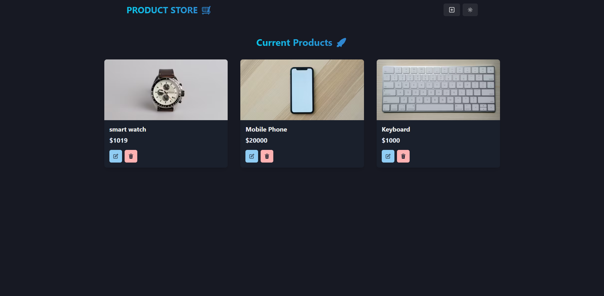

# 🛒 Product Management System (CRUD Operations)

A complete product management application with user-generated content and full CRUD functionality, built with Chakra UI for beautiful, accessible components.

## 🚀 Live Demo

 <!-- Replace with your actual demo link -->

## ✨ Features

-   **User-Created Products** - Add/manage your own products
-   **Full CRUD Operations** - Create, Read, Update, and Delete products
-   **Image Uploads** - Store product photos
-   **Responsive Dashboard** - Built with Chakra UI's responsive props
-   **Accessible Components** - Chakra UI's accessibility-first approach
-   **Dark/Light Mode** - Built-in theme support

## 🛠 Tech Stack

**Frontend**  

**Backend**  

## 🚀 Getting Started

### Prerequisites

-   Node.js (v18+ recommended)
-   MongoDB (local or [Atlas](https://www.mongodb.com/atlas))
